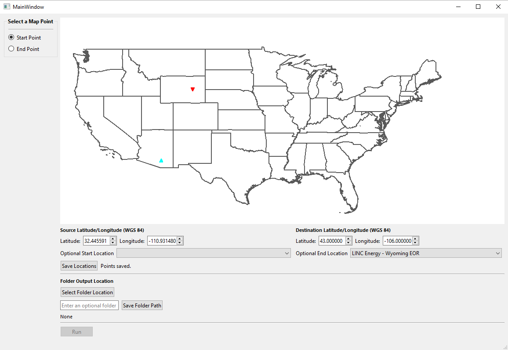
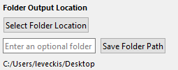

# Getting Started

## Getting Started From Binary (.exe)
Most users will likely interact with an executable version of the program, rather than interpreting it from source code. These users can simply double-click on the executable, `CO2Pipeline.exe`, to run the program. Skip to .

## Getting Started From Source Code
Developers and testing developers will have a few more steps to run the program. 
Firstly, you must have the correct virtual environment (python versioning and package collection) enabled. 
The following outlines virtual environment creation from the provided .yml file using Conda. 

Open Anaconda and navigate to the `exported_venv` folder in the source directory, and execute the following command:
        
        conda env create --name co2pipe --file=environment.yml

This will create an environment named "co2pipe" using the yaml file. Activate the environment via:
       
        conda activate co2pipe

:::{tip}
Unix users may simply use Python itself, or other tools, to create virtual environments from yaml files.
:::

With the virtual environment active, navigate back to the root source directory. Then run the main driver script, "CO2pipeline.py" via:

        python CO2pipeline.py

or, if you are a Unix user,

        python3 CO2pipeline.py

These commands should start the program akin to double-clicking the .exe as a standard user. See below for troubleshooting if not. It is normal for the program to take up to one minute to render. 

### Troubleshooting Setup
Sometimes virtual envirnoments do not want to play nice, based on operating system differences or any conda versioning tomfoolery therein. 
As an internal developer or tester seeking assitance, please reach out to Michael or Stephen with a log file that captures all errors created in a text file so they may more accurately and efficiently assist you. To do this, simply concatonate any command that is preventing progress with " > error_log.txt". For example, if your virtual environment setup is not executing successfully, you would want to re-run the command via the following:

        conda env create --name co2pipe --file=environment.yml > error_log.txt

and pass along the text file to one of the developers that would be happy to assist you. 

***
# Running the Program
Select the start and endpoint of your desired CO2 Pipeline path, choose output location, and start the program's path generation sequence. 
Once the Main window has rendered, hover over the main map area of the program and zoom to your desired start point using the scroll wheel.

## Point Selection

To place either a start or end point for your pipeline, select `Start Point` or `End Point` respectively from the left sidebar under the heading `Select a Map Point`. Once enabled based on your selection, you may place a point by 
* clicking anywhere on the map, 
* entering a precise latitude and longitude, 
* or selecting popular locations from the dropdown menu `Optional Start Location`. 

These options may be mixed and matched between start point and end point (for example, you may create a start point by clicking on the map area, and your end point by using the dropdown menu). The start point will be denoted in the map area by a point-up cyan triangle, and the destination by a point-down red triangle.

:::{tip}
A point's apparent location on the map and Lat/Long information will not be updated until the `Save Locations` is selected. (When specifying a point via Lat/Long or Optional Location).
:::

## Save Locations
After both points are placed accurately, click the `Save Locations` button. You may re-place points and re-click this button safely if you wish to edit your selections. This will not execute the path-generation sequence of the program. 

The above is the result of manually selecting a start point by clicking on the map area, choosing an end point from the `Optional End Location` dropdown, and selecting `Save Locations`.

## Output Folder and Program Execution
Then, click "Select Folder Location" to open a file explorer and select the folder you wish the program to output to. Alternatively, enter a folder path in the "Enter an Optional Folder" field and select `Save Folder Path`.

When your folder is selected successfully, the path will appear directly above the `Run` button. 

## Run
If you are satisfied with your points and output folder, click `Run` to execute the path-generation sequence of the program. 

***
# Retrieve and Review Results
When the program has completed running, eight different files will be exported to the directory specified earlier. This concludes the program's path creation functionality. New start and end points may be selected, or you may safely exit the program by closing the window conventionally.
